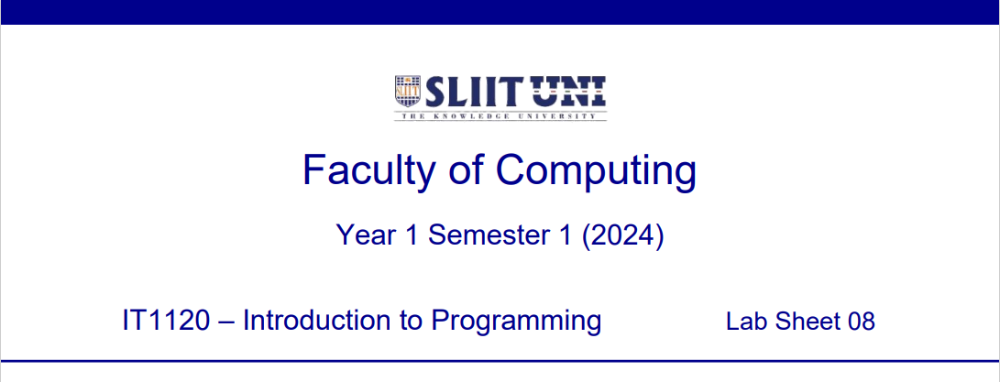

  

    
  

> **Question 1 (Tutorial 7 -- Q1)**
>
> a\) Write a Java program to input numbers via keyboard to an array
> called ***myArray***. Size of the array is 5.
>
> Print the contents of the ***myArray*** in the reverse order you
> entered.
>
> Save the file inside '**Lab 8**' folder as: **ITxxxxxxxxLab8Q1A.java**
> Replace 'ITxx xxx xxx' of the filename, with your own Student ID.
>
> Expected Output:

  

    
  

> b\) Create another array called ***evenArray***. Find the even numbers
> of array ***myArray***
>
> and store them in ***evenArray***.
>
> Save the file inside '**Lab 8**' folder as: **ITxxxxxxxxLab8Q1B.java**
>
> Replace 'ITxx xxx xxx' of the filename, with your own Student ID.
>
> Expected Output:

  

    
  

**Question 2 (Tutorial 7 -- Q2)**\
Write a Java program to add the content of array A and B and store it in
a new array called C.

int A\[5\] = 10, 20, 30, 40, 50;\
int B\[5\] = 34, 67, 12, 89, 12;\
int C\[5\];

Calculate A+B and store in Array C

Save the file inside '**Lab 8**' folder as: **ITxxxxxxxxLab8Q2.java**
Replace 'ITxx xxx xxx' of the filename, with your own Student ID.

Expected Output:

  

    
  

  **Question 3 (Tutorial 7 -- Q3)**\
Write a Java program to create an integer array of size 6.

Input numbers from the keyboard and store 6 positive numbers in the
array. If a negative number or [zero]{.underline} is entered, display an
error message.

Finally, find the **maximum number**.

***Note:*** A total of 6 positive numbers [should be]{.underline} stored
in the array

Save the file inside '**Lab 8**' folder as: **ITxxxxxxxxLab8Q3.java**
Replace 'ITxx xxx xxx' of the filename, with your own Student ID.

Expected Output:

  

    
  

**Question 4 (Tutorial 7 -- Q4)**\
Write a Java program to insert Student IDs of 8 students and store in an
array called ***studentsArray***. If a negative number or
[zero]{.underline} is entered, display an error message. Then [ask user
to enter a Student ID]{.underline} from the keyboard and
[fin]{.underline}d whether the Student ID is available in the array:

> • Display message *'Student is Available'* if the student is found.
>
> • Display message *'Student is Not Available'* if the student is not
> found.

Save the file inside '**Lab 8**' folder as: **ITxxxxxxxxLab8Q4.java**
Replace 'ITxx xxx xxx' of the filename, with your own Student ID.

Expected Output:

  

    
  

  
  

    
  

